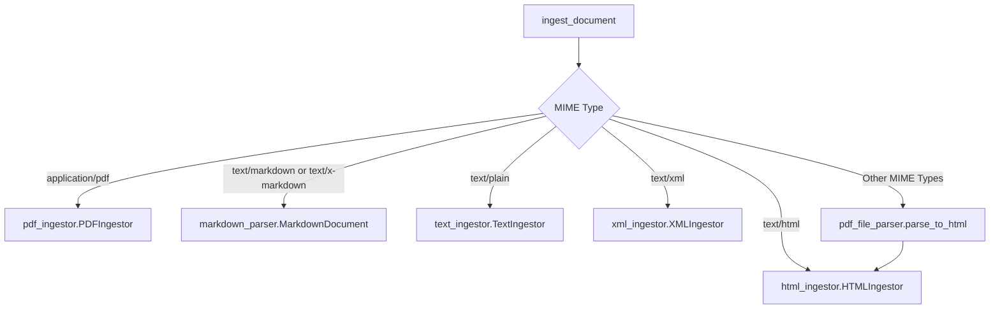

Here's the detailed documentation and function call diagrams for the provided Python file:

## Module: `nlm_ingestor`

### Functions:

1. `ingest_document(doc_name, doc_location, mime_type, parse_options: dict = None)`
   - Description: Ingests a document based on its MIME type and returns the parsed result along with the ingestor object.
   - Parameters:
     - `doc_name` (str): The name of the document.
     - `doc_location` (str): The location of the document.
     - `mime_type` (str): The MIME type of the document.
     - `parse_options` (dict, optional): Additional parsing options. Defaults to None.
   - Returns:
     - `return_dict` (dict): The parsed result dictionary.
     - `ingestor` (object): The ingestor object used for parsing.

### Imported Modules:

1. `nlm_ingestor.ingestion_daemon.config as cfg`
2. `nlm_ingestor.file_parser.markdown_parser`
3. `nlm_ingestor.ingestor_utils.utils`
4. `nlm_ingestor.ingestor.html_ingestor`
5. `nlm_ingestor.ingestor.pdf_ingestor`
6. `nlm_ingestor.ingestor.xml_ingestor`
7. `nlm_ingestor.ingestor.text_ingestor`
8. `nlm_ingestor.file_parser.pdf_file_parser`
9. `nlm_utils.utils`
10. `bs4.BeautifulSoup`
11. `numpy as np`

### Function Call Diagram:

The `ingest_document` function is the main entry point for document ingestion. It takes the document name, location, MIME type, and optional parsing options as input. Based on the MIME type, it selects the appropriate ingestor module to parse the document:

- For `application/pdf`, it uses `pdf_ingestor.PDFIngestor`.
- For `text/markdown` or `text/x-markdown`, it uses `markdown_parser.MarkdownDocument`.
- For `text/html`, it uses `html_ingestor.HTMLIngestor`.
- For `text/plain`, it uses `text_ingestor.TextIngestor`.
- For `text/xml`, it uses `xml_ingestor.XMLIngestor`.
- For other MIME types, it uses `pdf_file_parser.parse_to_html` to convert the document to HTML and then uses `html_ingestor.HTMLIngestor` to parse it.

The function returns the parsed result dictionary (`return_dict`) and the ingestor object used for parsing.

Note: The specific implementations of the ingestor modules (`PDFIngestor`, `MarkdownDocument`, `HTMLIngestor`, `TextIngestor`, `XMLIngestor`) are not provided in the given code snippet, so their internal workings cannot be documented based on the available information.